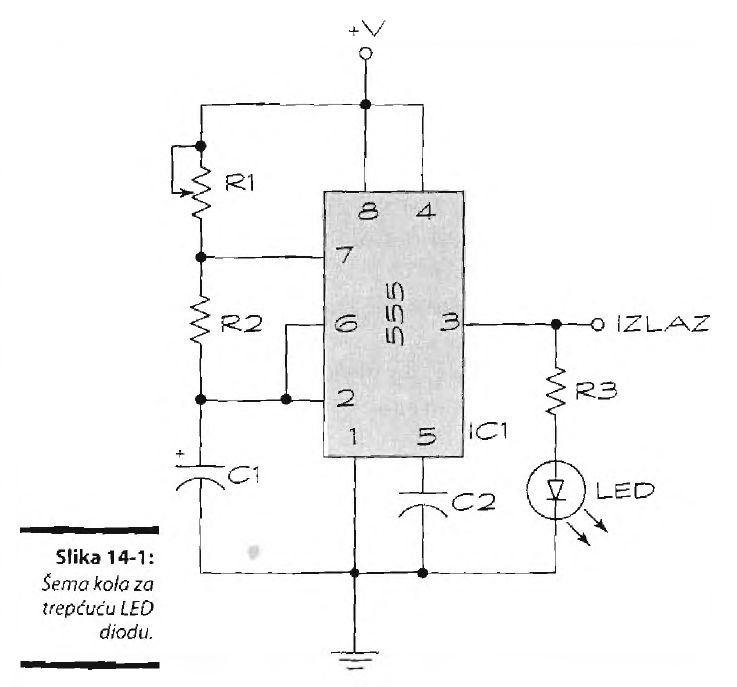

# Trepćuća svetla

Prvi projekat koji smo svi mi napravili bilo je svetlo koje se naizmenično uključivalo i isključivalo. Nije radilo ništa drugo, ali i to je bilo dovoljno. Valjalo je zalemiti tranzistor, otpornik i diode. Trebalo mi je dva dana i 17 dolara za delove. 

Danas je zahvaljujući posebnom integrisanom kolu pravljenje trepćućeg svetla prosto. Tajmer LM555 je za elektroniku ono što je mleko za kolače. Osnova je mnogih projekata koje ćete praviti. Čip 555 možete koristiti na različite načine, ali najbitnija njegova funkcija jeste davanje impulsa u pravilnim intervalima. Čip LM555 (ili njegovu odgovarajuću zamenu) možete kupiti u skoro svakoj prodavnici elektroopreme. Mi volimo da ih kupujemo u paketima od 15 do 20 - tako štedimo novac. Ne brinite da ćete natrpati previše zaliha, brzo ćete ih istrošiti.

## Uputstvo

Šemu trepćućeg svetla prikazali smo na slici. Pokazano je kako da spojite tajmer 555 s LED diodom. Kada se izmeni otpornost promenljivog otpornika (potenciometra) Rl, menja se brzina treptanja. Kolo sa trepćućom LED diodom lako se pravi. Rukovodite se šemom sa slike. Primetićete da smo povećali razmak između komponenti kako bi sve bilo jasnije. Uvek je bolje udaljiti komponente, nego ih zbiti, jer ćete bolje videti šta radite.

Da bi napravili kolo, uradite sledeće:
1. Prikupite sve potrebne komponente. Pogledajte spisak delova koji je priložen dole. Nema ničeg goreg no da počnete projekat, i stanete na pola posla jer nemate sve delove!
2. Pažljivo postavite tajmer 555 na sredinu ploče. Integrisano kolo trebalo bi da „opkorači“ prazan srednji red ploče. Referentna oznaka (malo udubljenje ili jamica na jednom kraju čipa) trebalo bi da bude okrenuta ka levoj strani ploče - tako se podrazumeva medu elektroničarima.
3. Na ploču postavite dva nepromenljiva otpornika, R2 i R3, prateći šemu sa slike. Pomenuli smo da su pinovi na integrisanom kolu označeni brojevima u smeru suprotnom od kretanja kazaljke, počev od referentne oznake. Dakle, ako gledate u prototipsku ploču sa tajmerom 555, i njegova referentna oznaka je na vašoj levoj strani, pin 1 je levo od referentne oznake, dok su pinovi 2, 3 i 4 redom raspoređeni nadole na levoj strani integrisanog kola. Na desnoj strani čipa, pin 5 je naspram pina 4, a pinovi 6, 7 i 8 redaju se naviše.
4. Na ploču postavite dva kondenzatora, Cl i C2, prateći šemu sa slike.
5. Zalemite žice za potenciometar (Rl) da bi ga povezali s pločom. Upotrebite punu žicu debljine 0,6 mm sa kukom na kraju. Primetićete da potenciometar ima tri izvoda. Jedan ga povezuje s pinom 7 čipa 555; druga dva izvoda su spojena i povezana sa pozitivnim (V+) polom napajanja.
6. Povežite LED diodu kako je pokazano na šemi. Katodu LED diode morate povezati na masu.
7. Upotrebite punu žicu debljine 0,64 mm, po mogućstvu već ogoljenu i pripremljenu za korišćenje na prototipskoj ploči, da bi dovršili sve veze. Ove žice poznate su kao kratkospojnici; većina kola koja budete pravili imaće bar jednu ili dve.
8. Pre priključivanja napajanja, dvaput proverite ono što ste uradili. Uporedite sve veze sa šemom.
9. Na kraju, priključite bateriju od 9 volti na redove za V+ napajanje i za uzemljenje na prototipskoj ploči. Lakše je upotrebiti kabl sa konektorom za bateriju od 9 volti. Dobro bi bilo zavariti punu žicu s kukicom za krajeve kabla konektorom; tako ćete lakše umetnuti žice u prototipsku ploču.

Kada priključite napajanje za kolo, LED dioda bi trebalo da zasvetli. Obrtanjem dugmeta potenciometra Rl promenićete brzinu treperenja svetla. Ako kolo ne radi, isključite bateriju od 9 volti, i ponovo proverite sve veze.

Evo nekoliko uobičajenih grešaka:
* Postavili ste integrisano kolo 555 IC naopako. To može oštetiti čip, pa ako do toga dođe, preporučujemo da uzmete drugi tajmer 555.
* Umetnuli ste LED diodu naopako. Izvucite je i obrnite.
* Niste dovoljno duboko utisnuli žice i izvode komponenti u otvore na prototipskoj ploči.
* Vrednosti komponenti su pogrešne. Proverite ih dvaput, za svaki slučaj!
* Baterija je „crkla“. Stavite novu.
* Pogrešno ste povezali žice. Pozovite prijatelja da pogleda - tuđe oči mogu da uoče greške koje ste možda prevideli.

## Spisak potrebnih delova

Evo potrebnih delova za kolo sa trepćućom LED diodom:
* IC1: Integrisano kolo, tajmer LM555
* Rl: Potenciometar od 1 megaoma
* R2: Otpornik od 47 kilooma
* R3: Otpornik od 330 oma
* Cl: Tantalov (polarizovan) kondenzator od 1 pF
* C2: Blok (nepolarizovan) kondenzator od 0,1 pF
* LED: LED dioda (bilo koja boja svetla)
