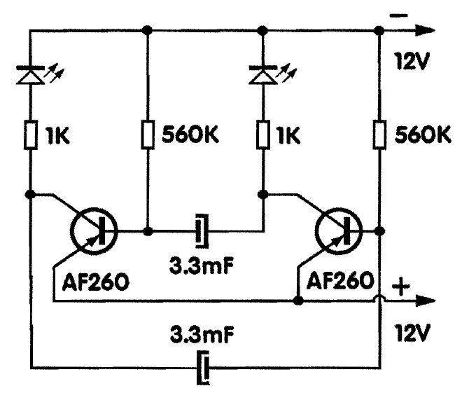
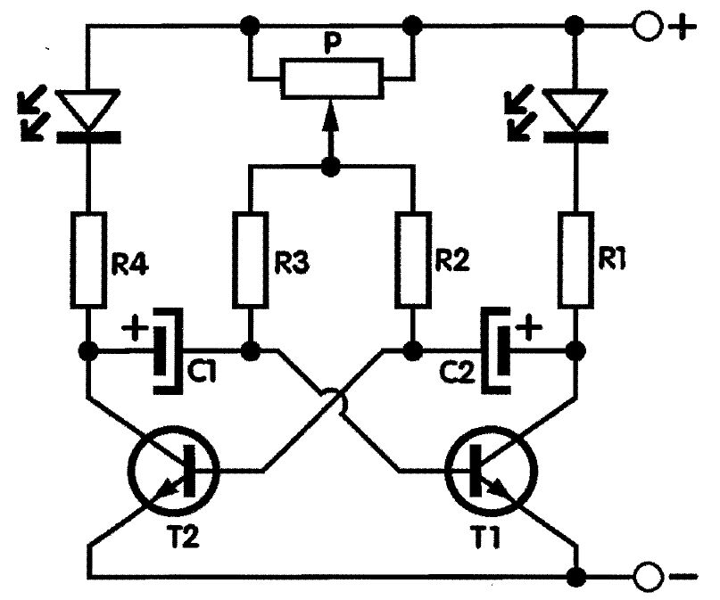

# Treptavo svetlo (tranzistorski migavac)

Ovaj sklop je generator naizmenične struje čija frekvencija zavisi od veličine kondenzatora i otpornika. Zato se i zove RC (*resistor-capacitor*) oscilator. Radi tako što struja puni naizmenično jedan pa drugi kondenzator, što se manifestuje u paljenju i gasenju LE diode spojene u kolektorskom kolu.

Frekvencija oscilovanja zavisi ad veličina RC. Vrednosti otpornika nije pozeljno menjati ali mogu se stavljati veći iii manji kondenzatori. Stavimo li veći kondenzator frekvencija će biti manja i obratno. Frekvendja je broj treptaja LE diode u jedinici vremena.

Umesto AF260, mogu se upotrebiti bilo koji tranzistori PNP tipa bez ikakvih izmena. Ako želite tranzistore NPN tipa morate okrenuti polaritet napajanja, kao i polaritet elektrolitskih kondenzatora!

## Šema

## Delovi

- Tranzistor, germanijumski, PNP, AF260 x 2
- LE dioda x 2
- Elektrolitski kondenzatori, aksijalni, 220μF x 2
- Otpornik, ugljenoslojni, 1/4W, lOO Ω (braon-cma-braon-zlatna) x 2
- Otpornik, ugljenoslojni, 1/4W, lOK Ω (braon-crna-narandzasta-zlatna) x 2
- Baterija od 4.5 V

# Treptavo svetlo 12 V

## Šema

## Delovi

- Tranzistor PNP tipa AF260 x 2
- Elektrolitski kondenzator 3.3 μF x 2
- Otpornik 1 KΩ (braon-crna-crvena-zlatna) x 2
- Otpornik 560 KΩ (zelena-plava-braon-zlatna) x 2
- LE diode x 2

# Treptavo svetlo sa podešavanjem

Brzinu treptaja regulišemo trimer potenciometrom. Lepo je i efektno da se stave dve raznobojne LE diode.

Ostaje da spomenemo zaštitne otpornike Rl i R4 koji služe zato da LE diode ne bi direktno spojili na napon napajanja.

## Šema

## Delovi

- T1 i T2, tranzistori NPN tipa, oznake BC546  x 2
- LED diode raznobojne x 2
- Cl, C2, elektrolitski kondenzator 10 μF, min. 16V x 2
- Rl, R4, otpornik, 1 KΩ (braon-crna-crvena-zlatna)  x 2
- R2, R3, otpornik 4.7 KΩ (zuta-ljubičasta-crvena-zlatna) x 2
- P, trimer potenciometar, 2.5 MΩ x 1

Izvor: Mala škola elektronike
