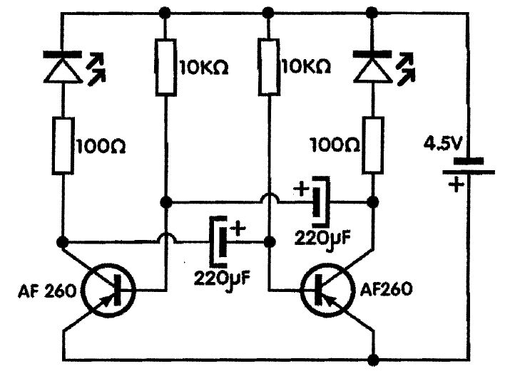

# Treptavo svetlo (tranzistorski migavac)

Ovaj sklop je generator naizmenične struje čija frekvencija zavisi od veličine kondenzatora i otpornika. Zato se i zove RC (*resistor-capacitor*) oscilator. Radi tako što struja puni naizmenično jedan pa drugi kondenzator, što se manifestuje u paljenju i gasenju LE diode spojene u kolektorskom kolu.

Frekvencija oscilovanja zavisi ad veličina RC. Vrednosti otpornika nije pozeljno menjati ali mogu se stavljati veći iii manji kondenzatori. Stavimo li veći kondenzator frekvencija će biti manja i obratno. Frekvendja je broj treptaja LE diode u jedinici vremena.

Umesto AF260, mogu se upotrebiti bilo koji tranzistori PNP tipa bez ikakvih izmena. Ako želite tranzistore NPN tipa morate okrenuti polaritet napajanja, kao i polaritet elektrolitskih kondenzatora!

## Šema

## Delovi

- Tranzistor, germanijumski, PNP, AF260 x 2
- LE dioda x 2
- Elektrolitski kondenzatori, aksijalni, 220μF x 2
- Otpornik, ugfjenoslojni, 1/4W, lOO Ω (braon-cma-braon-zlatna) x 2
- Otpornik, ugljenoslojni, 1/4W, lOK Ω (braon-crna-narandzasta-zlatna) x 2
- Baterija od 4.5 V

Izvor: Mala škola elektronike