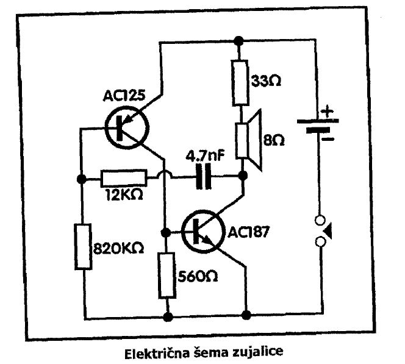

# Zujalica

Zujalica je jedan od najlakših projekata za početnike. To je spoj sa dva komplementarna tranzistora AC125 i AC187 (odgovaraju komplementarnom paru AC188 i AC187). Prvi je PNP a drugi NPN tipa.

## Šema

Frekvencija oscilacija određuje se kondenzatorom od 4700 pF (4.7 nF) i otpornikom od 12 KΩ. Menjanjem ovih elemenata menja se i frekvencija oscilatora, od nekoliko herca do nekoliko kiloherca.

Sa otpornikom od 820 KΩ određuje se radna tačka PNP tranzistora AC125, a sa otpornikom od 560 Ω određuje se radna tačka odnosno struja koja prolazi kroz NPN tranzistor AC187.
