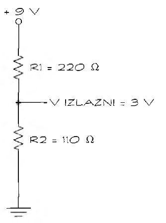

# Razdelnik napona

Napon „vuče“ elektrone kroz žicu. Otpornici se suprotstavljaju kretanju elektrona kroz njih, koristeći deo napona. To smanjivanje napona zove se pad napona.

Kolo pod nazivom razdelnik napona koristi pad napona za stvaranje napona manjeg od izvora napajanja u određenim tačkama kola. Na primer, recimo da je napajanje 9 volti, ali neka komponenta se napaja manjim naponom. Razdelnikom napona smanjićemo napon.



Recimo da u kolu imamo dva otpornika (220 Ω i 330 Ω) i napajanje od 9 V. Pad napona na svakom otporniku proporcionalan je njegovom otporu podeljenom ukupnom otpornošću:
```
Pad napona na otporniku R1 = (R1 / (R1 + R2)) * Vt = 220 Ω / 330 Ω * 9 V = 6 V
```

Izlazni napon se izračunava oduzimanjem napona na otporniku R1 od napona izvora napajanja:
```
V(out) = V(in) - V(R1) = 9 volti - 6 volti = 3 volta
```

Šta ako vam je potreban neki drugi izlazni napon? Promenite otpornik. Na primer, ako želite da izlazni napon bude upola manji od napajanja, upotrebite dva otpornika iste otpornosti. Zatim upotrebite jednačinu da bi izračunali pad napona na otporniku Rl:
```
Pad napona na otporniku R1 = jedna polovina Vt
```

Ako izlazni napon treba da ima vrednost dve trećine napona napajanja, upotrebite R1 čija je otpornost upola manja od otpornosti otpornika R2. Ponovo izračunajte pad napona:
```
Pad napona na otporniku R1 = jedna trećina Vt
```
