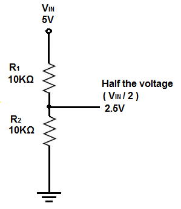

# Razdelnik napona

Napon "gura" elektrone kroz žicu, a otpornici se suprotstavljaju kretanju elektrona, smanjujući napon. To smanjenje napona na komponenti zove se **pad napona**. 

**Razdelnik napona** je kolo koje pomoću pada napona u jedom delu stvara manji izlazni napon od ulaznog.

## Formule

Izlazni napon se izračunava formulom:

```
V(izlaz) = (R2 / (R1 + R2)) * V(ulaz)
```

Pad napona na otporniku R1 računamo formulom:

```
V(R1) = (R1 / (R1 + R2)) * V(ulaz)
```

Izlaz možemo izračunati i oduzimanjem pada napona R1 od ulaznog napona.

## Primer: ulaz 9V -> izlaz 3V


Na primer, u kolu imamo dva otpornika (220 Ω i 110 Ω) i napajanje od 9 V. Pad napona na otporniku R1 je:

```
V(R1) = (220 Ω / (220 Ω + 110 Ω)) * 9 V
      = (220 Ω / 330 Ω) * 9 V 
      = 2 / 3 * 9 V 
      = 6 V
```

Izlazni napon računamo oduzimanjem napona na otporniku R1 od ulaznog napona:

```
V(izlaz) = V(ulaz) - V(R1)
         = 9 V - 6 V
         = 3 V
```

Izlazni napon se može izračunati i direktno:

```
V izlaz = 110 / 330 * 9V
        = 1/3 * 9V
        = 3V
```

## Primer: izlaz pola ulaza



Ako želimo da izlazni napon bude pola od ulaznog, koristimo dva otpornika iste otpornosti. Pomoću jednačine možemo izračunati pad napona na otporniku R1:

```
V(R1) = R1 / (R1 + R1) * Vt
      = R1 / 2 * R1 * Vt
      = 1 / 2 Vt
```

## Primer: izlaz 2/3 ulaza

Ako izlazni napon treba da ima vrednost dve trećine ulaznog napona, koristimo R1 čiji je otpor upola manji od R2. Pad napona računamo jednačinom:
```
V(R1) = R1 / (R1 + 2 R1) * Vt
      = R1 / 3 R1 * Vt
      = 1 / 3 Vt
```

## Kako izabrati odgovarajuće otpornike?

Da bismo dobili željeni izlaz, jedan otpornik uzimamo nasumično, a drugi računamo pomoću formule:

```
R2 = V(izlaz) * R1 / (V(ulaz) - V(izlaz))
```
