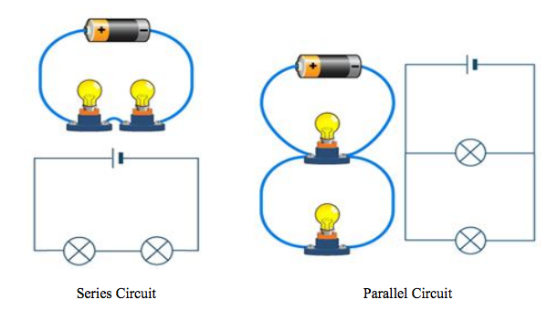
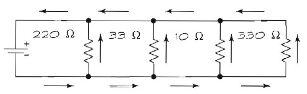

# Redna i uporedna kola

Komponente u kolu možete povezati **redno**, tako da struja iste jačine protiče kroza sve komponente, ili **paralelno**, tako da deo struje protiče kroz jednu komponentu a deo kroz drugu, i tako redom.



## Redna veza

Recimo da imamo kolo sastavljeno od baterije, sijalice i otpornika. Elektroni se kreću od negativnog pola baterije kroz sijalicu a zatim prolaze kroz otpornik. Takav raspored komponenti zove se redna veza, što znači da elektricitet redom struji kroz komponente.

### Redna veza otpornika

Ukupan otpor u kolu izračunavamo sabiranjem otpornosti komponenti. Recimo da imamo kolo sa četiri otpornika u rednoj vezi. Da bi izračunali ukupnu otpornost kola (Rt), saberite otpornost svih otpornika. Na primer:

```
Rt = 220 Ω + 33 Ω + 10 Ω + 330 Ω 
   = 593 Ω
```

Tako dobijenu vrednost Rt možemo, na osnovu Omovog zakona, upotrebiti za izračunavanje struje u kolu. Ako je napajanje 9 volti, sledi:

```
I = V / R 
  = 9 V / 593 Ω 
  = 0,015 ampera ili 15 miliampera
```

Zašto bih morao da vodim računa o jačini struje u kolu, pitate se? Postoje dva zaista dobra razloga:
* Čak i najizdržljivije komponente mogu da podnesu samo određenu jačinu struje. Na primer, LED dioda će verovatno pregoreti ako kroz nju propustite više od 50 miliampera.
* Napajanje može da obezbedi struju samo određene jačine. Da bi sve radilo kako je predviđeno, obezbedite izvor napajanja koji će dati onoliko struje koliko je potrebno.

## Uporedna veza

U kolima s rednom vezom može se naići na sledeći **problem**: ako jedna komponenta otkaže, ona prekida struju kola. Na primer, ako svetleća reklama ima dvesta redno vezanih sijalica, čim jedna pregori, sve prestaju da svetle.

Postoji jednostavno **rešenje** - komponente možemo povezati paralelno. Dakle, ako u svetlećoj reklami ima dvesta paralelno vezanih sijalica i jedna pregori, 199 preostalih i dalje svetli. Naravno, neko slovo može se nehotično izmeniti :)



Evo kako radi kolo sa slike: elektroni se kreću od negativnog pola baterije, prolaze kroz svaki otpornik i stižu do pozitivnog pola baterije. Elektroni koji prođu kroz jedan otpornik, ne prolaze kroz ostale. Ukupna otpornost kola izračunava se sledećom jednačinom:

```
Rt = 1 / (1/220 Ω + 1/33 Ω + 1/10 Ω + 1/330 Ω) 
   = 7,2 Ω
```

Za razliku od rednog kola, gde je ukupan otpor zbir svih otpora, u uporednom kolu je **ukupan otpor manji od najmanjeg otpora**. 

Ukupnu struju u kolu računamo tako što unesemo ukupan otpor u Omov zakon. Ako je i ovde napajanje 9 volti, ukupna struja iznosi 1,25 ampera:
```
I = V / Rt 
  = 9 volti / 7,2 Ω 
  = 1,25 ampera
```

Ako u ovom primeru koristimo bateriju kao izvor napajanja, ona će se istrošiti vrlo brzo. Na baterijama je navedena vrednost u ampersatima. Baterija od jednog ampersata traje samo sat vremena ako napaja kolo koje crpi jedan amper. Zato prilikom izbora napajanja moramo uzeti u obzir jačinu struje i koliko dugo kolo mora da radi.
