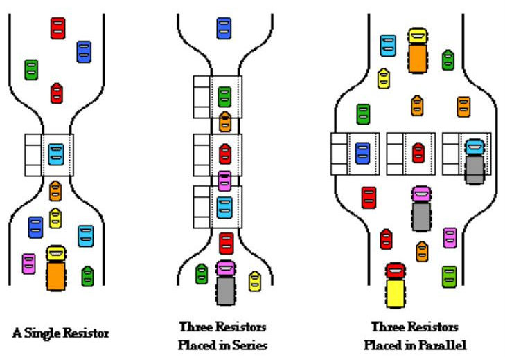

# Poređenje sa saobraćajem (saobraćajna analogija)

- **Elektroni** - vozila
- **Napon (V)** - razlika u broju vozila između dve tačke.
- **Električna struja ili električni tok (I)** - saobraćajni tok ili tok vozila.
- **Naboj (Q)** - broj vozila u nekom delu mreže.
- **Provodnik** - put; što širi više provodi. **Preopterećenje provodnika** - gužva. 
- **Otpor (R)** - smanjena prohodnost vozila.
- **Otpornik** - usko grlo (suženje puta, rupe, krivine, ograničenje brzine, radovi).
- **Izolator** - prepreka, barikada.
- **Kondenzator (C)** - parking pored puta koji brzo prima i pušta vozila; drži napon stabilnim.
- **Induktor (L)** - kolona kamiona; suprotstavlja se naglim promenama toka.
- **Dioda** - jednosmerna ulica.
- **Prekidač** - rampa, semafor.
- **Uzemljenje** - praktično beskonačan parking koji prima višak vozila.
- **Izvor napona** - izvor vozila, npr. ulaz sa autoputa ili velika garaža odakle stalno izlazi određeni broj vozila, održavajući tok.
- **Otvoreno kolo** - prekinut put (nema saobraćajnog toka).

## Redna i paralelna kola

- **Redno vezani otpornici** - više uskih grla zaredom; veći ukupni otpor.
- **Paralelno vezani otpornici** - paralelni putevi; manji ukupan otpor (veći kapacitet).
- **Razdelnik napona** (redno grananje) – dugačak put sa više rednih isključenja. Isti saobraćajni tok (struja) prolazi kroz sve, ali „pritisak gužve“ (napon) opada deo po deo.
- **Razdelnik struje** - čvor gde se put razdvaja na više paralelnih puteva; „pritisak“ (napon) na ulazu je svima isti; tok se deli između puteva obrnuto proporcionalno otporu, odnosno srazmerno njihovoj širini.
