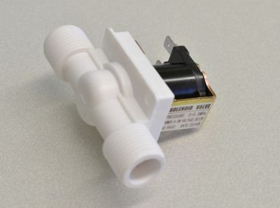

# Solenoidi

Solenoid je zavojnica koja, kada kroz nju prođe struja, stvara magnetno polje i povuče mali metalni klip. Na taj način električna energija pretvara se u pokret.

Tipična primena je u bravama, ventilima (solenoidni ventil), automobilskim starterima i relejima. Relej u sebi ima mali solenoid koji povlači polugu i zatvara ili otvara električni kontakt.

## Upotreba solenoida

* elektronske brave i automatska vrata
* ventili za navodnjavanje i kućne aparate
* automobili (starter, pumpe)
* industrijski i medicinski uređaji

## Vrste solenoida

* **linearni** – pomeraju klip napred–nazad, koriste se u bravama i prekidačima
* **rotacioni** – umesto pravolinijskog pomaka, okreću klip pod određenim uglom
* **solenoidni ventili** – otvaraju ili zatvaraju prolaz za vodu, vazduh ili gas

Solenoidi mogu biti monostabilni i bistabilni:
- Monostabilni da bi ostali u drugom položaju, moraju imati stalno uključenu zavojnicu. Na primer, relej drži kontakt dok mu ide struja. Kad nestane struje, opruga se vraća nazad. 
- Bistabilni kad se prebace u određeno stanje, ostaju tu bez napajanja. Potreban im je samo kratak impuls da promene stanje, pa su energetski efikasniji.

## Solenoidni ventil

Solenoidni ventil (ili elektromagnetni ventil) služi za kontrolu protoka tečnosti (ili gasa) pomoću električnog kola. Često se koristi u automatskim [sistemima za navodnjavanje](arduino-projekti/navodnjavanje-ventilom.md).
