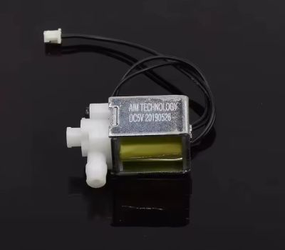

# Solenoidni ventil

**Solenoidni ventil** (ili **elektromagnetni ventil**) služi za kontrolu protoka tečnosti ili gasa pomoću električnog kola. Često se koristi u automatskim [sistemima za navodnjavanje](arduino-projekti/navodnjavanje-ventilom.md).

## Veliki solenoidni ventil


Veliki solenoidni ventil od plastike namenjen za vodu. Podržava pritisak od 0 do 0.8 MPa (do oko 8 bara). 

Oznaka **normalno zatvoren** (*normally closed*, NC) znači da je ventil zatvoren kada nije pod naponom. Ventil je otvoren samo dok se dovodi napon – kada se struja isključi, opruga ga automatski zatvara.

Ima **muški navoj** sa obe strane. **Veličina navoja** je  1/2" ili 3/4", zavisno od modela. Ventil treba montirati u pravom smeru (videti strelicu na kućištu), kako bi ga filter štitio.

### Napajanje i potrošnja

Za ventil je potrebno napajanje od **12 V** jednosmerne struje (DC). Tipičan DC 12V solenoid ventil troši oko **2–5 W** na sat. Na primer, ako ventil troši 5 W i radi 2 sata:

```
energija (Wh) = snaga (W) * vreme (h)
              = 5 × 2 = 10 Wh.
```

Dakle, za dva sata konstantnog napajanja potrošnja je oko 10 vat-sati.

## Mali solenoidni ventil



Mali solenoid radi na **5V** jednosmjerne struje i troši oko 480 mA. Može se napajati istim napajanjem kao i Arduino, bez posebnog izvora. 

U normalnom stanju je zatvoren, a kada mu dovedemo struju, otvara se i propušta vodu. Solenoidni ventil ne pravi pritisak, samo propušta vodu koja već ima pritisak. Dakle, služi kao prekidač protoka, ne kao pumpa.

## Vidi još

- [Sistem za navodnjavanje ventilom](arduino-projekti/navodnjavanje-ventilom.md)
