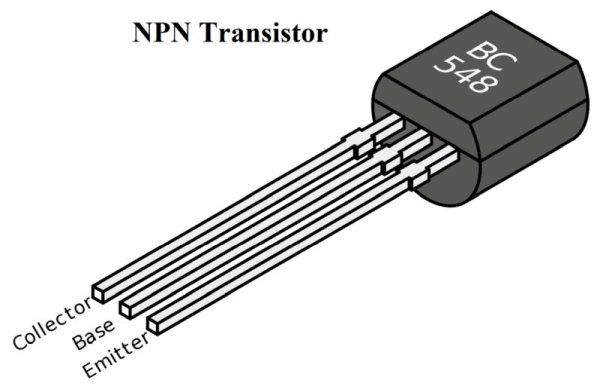
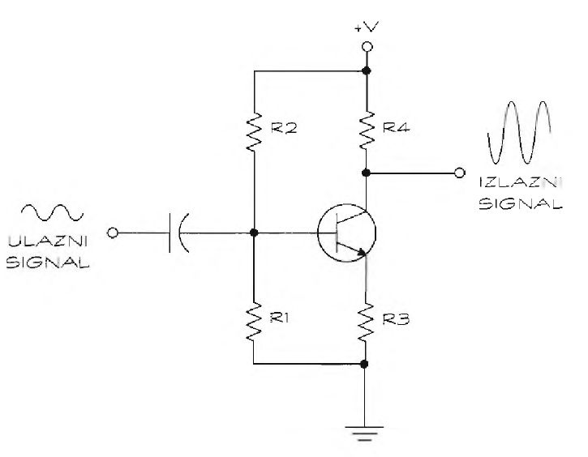
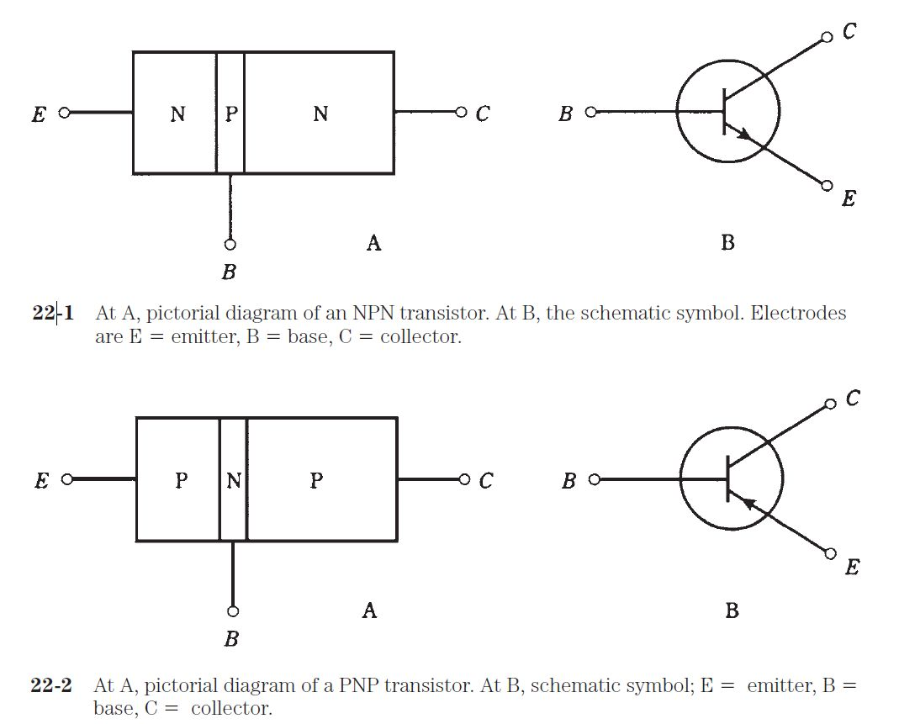

# Tranzistori

[wiki](https://sh.wikipedia.org/wiki/Tranzistor)

**Tranzistor** upravlja tokom električne struje tako što otvara i zatvara svoje „ventile“. Reč tranzistor je kovanica koja znači prelazni otpornik (*trans rezistor*). Tranzistore možemo koristiti kao prekidače ili kao pojačavače.

Tranzistori su razvijeni kao alternativa vakuumskim lampama. Milioni pojedinačnih tranzistora čine mikroprocesor u srcu svakog računara.

## Brojčana oznaka

Postoji više hiljada različitih tranzistora. Jedinstvena brojčana oznaka, kao što je 2N2222 ili MPS6519, identifikuje tranzistor. Ako želite da napravite kolo po dijagramu, pronađite tranzistor na osnovu njegove oznake, ili njegovu zamenu.

## Kućište tranzistora

Poluprovodni materijal tranzistora veličine je zrna peska, čak i manji. Za tako mali predmet teško je zalemiti žice, pa se tranzistore smeštaju u kućišta. Treba obratiti pažnju na sledeće:

* Materijal: Tranzistori za pojačavanje signala prave se u plastičnim ili metalnim kućištima. Za većinu primena dobro je plastično, ali za precizne sprave neophodno je metalno kućište, jer je otpornije na radio-smetnje. 
* Tranzistori za pojačavanje signala skoro uvek imaju tri izvoda, a fototranzistori dva.
* Veličina: Tranzistori snage veći su od onih za pojačavanje signala.

## Tranzistor kao prekidač

Prekidač otvara i zatvara put kojim protiče električna struja. Tranzistor možemo koristiti kao električno upravljan prekidač. 

Tranzistori obično imaju tri izvoda. To su:
* baza 
* emiter 
* kolektor

Kada se tranzistor koristi kao prekidač, baza se ponaša kao poluga na mehaničkom prekidaču. Kada na bazu dovedete struju, tranzistor se uključi, a bez struje je isključen. Emiter i kolektor vezuju se za pozitivan ili negativan napon. Koji se izvod s čim povezuje, zavisi od električnog kola. Tranzistori kao prekidači sastavni su deo integrisanih kola koja sadrže logička kola, na primer za kalkulatore i računare.

### Primer: paljenje u svitanje

Recimo da koristite uređaj koji se automatski pali u svitanje. Uređajem upravlja fotodioda, koja obezbeđuje ulazni signal za tranzistor. Po mraku, fotodioda ne generiše struju. Čim zora zarudi, fotodioda počinje praviti struju i tranzistor se uključuje. Po uključenju tranzistora, struja stiže do uređaja.

## Tranzistor kao pojačavač

Često je neophodno pojačati signal, na primer od mikrofona do zvučnika. Pojačavač mora da ima tranzistor koji je delimično uključen. Da bi se tranzistor delimično uključio, na bazu se dovodi mali napon polarizacije (en. *bias*). Taj postupak se zove pobuđivanje tranzistora. 

Pobuđeno stanje čini glavnu razliku između korišćenja tranzistora kao pojačavača i kao prekidača. Kada se tranzistor koristi kao prekidač, tranzistor je ili uključen ili isključen. U slučaju kada se koristi kao pojačavač, primenjuje se napon polarizacije, ili pobuda, na bazu kako bi tranzistor bio delimično uključen. Zamislite to kao rad automobila u leru. 

Prednost tranzistora u pobuđenom stanju jeste što reaguje na svaku promenu ulaznog signala. Neophodno je na bazu dovesti napon od oko 0,6 volti (između baze i emitera) da bi se tranzistor uključio. Ako tranzistor nije uključen, ulazni signal manji od 0,6 volti ne proizvodi izlazni signal. Međutim, kada je tranzistor pobuđen, on pojačava ceo ulazni signal.

Pojačanje (en. *gain*) predstavlja meru pojačanja signala. Na primer, pri pojačanju 10, ulazni signal od 1 volta postaje izlazni signal od 10 volti.

Možete povezati više od jednog tranzistora i postići nekoliko stepeni pojačanja. 

### Primer: prost pojačivač

Na slici je kolo s tranzistorskim pojačavačem. Da bi se tranzistor pobudio otpornici R1 i R2 vezani su na bazu i konfigurisani kao [razdelnik napona](razdelnik-napona). Izlaz iz razdelnika obezbeđuje napon baze dovoljan za uključivanje tranzistora i omogućavanje struje. Kada pojačavač primi naizmenični ulazni signal, kao onaj koji potiče iz mikrofona, signal mora biti oko 0 volti da bi održao napon polarizacije tranzistora. Kondenzator na ulazu filtrira sva odstupanja od 0 volti jednosmernog napona (DC pomeraj) ulaznog signala. Preostala dva otpornika, R4 između emitera i uzemljenja i R3 između kolektora i izvora napona (+V), upravljaju pojačanjem.

### Operacioni pojačavač

Operacioni pojačavač je integrisano kolo koje sadrži nekoliko tranzistora i drugih komponenti. Ovaj pojačavač radi mnogo bolje od pojačavača sa jednim tranzistorom. Može da obezbedi uniformno pojačanje u mnogo širem opsegu učestanosti. Za operacioni pojačavač potrebni su i pozitivan i negativan napon napajanja. Pozitivan napon je u opsegu od 8 do 12 volti, a negativan u opsegu od -8 do -12 volti.

## Podela tranzistora

Dva najčešća tipa su bipolarni i unipolarni (FET) tranzistori. Pod tranzistorom se podrazumeva bipolarni, ako nije naglašeno drukčije. 
* **bipolarni**: na bazu tranzistora dovodi se mala ulazna struja, čime se menja jačina struje između kolektora i emitera.
* **unipolarni (tranzistori sa efektom polja, FET)**: imaju tri izvoda, ali se zovu gejt, sors i drejn. Dovođenjem napona na gejt upravlja se strujom između sorsa i drejna. Postoje dve vrste FET tranzistora: 
  * sa N kanalom (slično NPN tranzistoru) i 
  * sa P kanalom (slično PNP tranzistoru).

### Bipolarni tranzistori: NPN i PNP

Po tipu spoja, tranzistori se dele na NPN i PNP, što ukazuje na vrste poluprovodničkih materijala u tranzistoru. Na osnovu izgleda ne možete razlikovati NPN i PNP tranzistore, već iz specifikacije. Na dijagramu, uvek možete razlikovati je li bipolarni tranzistor NPN ili PNP. Kod NPN-a strelica pokazuje ka spolja, a kod PNP-a ka unutra. Strelica je uvek na emiteru.

Ako se u kolu zahteva PNP tranzistor, ne možete ga zameniti NPN tranzistorom. Načelno, NPN i PNP tranzistori rade iste stvari u kolu, ali se razlikuju u polarnosti napona i smeru struje.

### FET tranzistori: MOSFET i JFET

FET tranzistori imaju dve podvrste: MOSFET i JFET. 

Pražnjenje statičkog elektriciteta može da ošteti FET tranzistore. Zato ih čuvajte u antistatičkoj peni. Kada ih kupite, držite ih u antistatičkoj vrećici i ne vadite ih dok vam ne zatrebaju.
